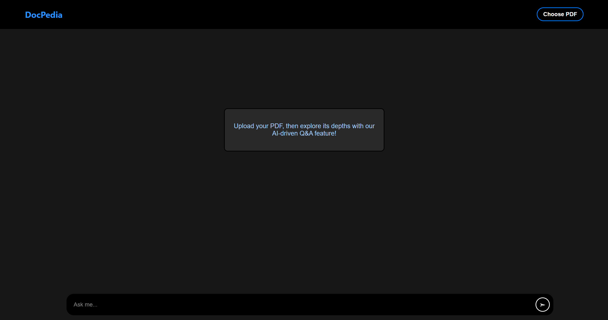
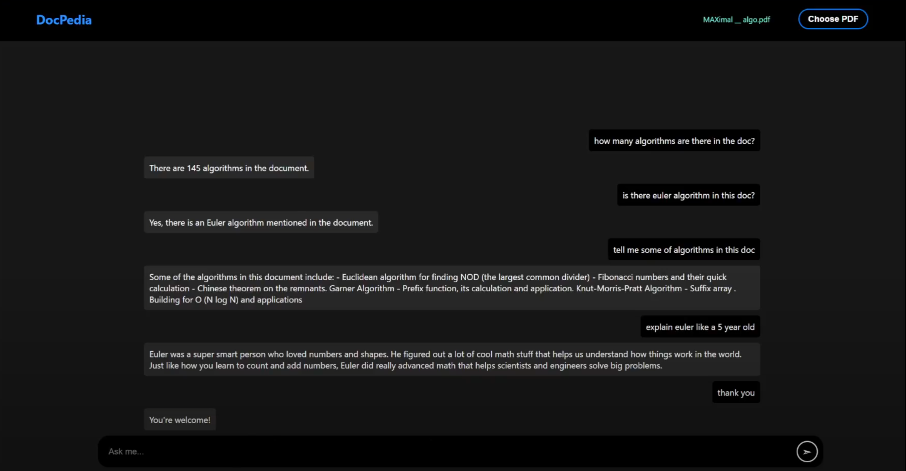

# DocPedia

DocPedia is an AI-based document querying application that enables users to upload PDF documents and query any information contained within them. With DocPedia, you can easily extract and retrieve specific information from your documents using LlamaIndex natural language queries. This app is powered by GPT-3.5 Turbo and OpenAI Embedding models.

Additionally, users can ask any question about the document's content and receive detailed explanations, making it a powerful tool for understanding and interacting with your document data. It stores the PDF using AWS S3 Bucket and uses boto3 to interact with the data and it can learn from several PDFs by indexing it together.



 

Video Demonstration of the App in Action: [Video Demonstration](https://drive.google.com/file/d/1QXX-mYXZqt5-ZrJb6pg4ozZrmauOYDYO/view)

## Features

- **PDF Upload**: Upload your PDF documents to the platform effortlessly.
- **Natural Language Queries**: Ask questions about the uploaded documents using natural language queries.
- **AI-powered Document Analysis**: DocPedia leverages Open AI algorithms to analyze and extract relevant information from the uploaded documents.
- **FastAPI Backend**: The backend of DocPedia is built using FastAPI, a modern Python web framework.
- **React Frontend**: The frontend interface of DocPedia is developed using React.js, providing a responsive and intuitive user experience.
- **AWS S3 Storage**: The app uses AWS S3 storage to save the PDF files, which are collectively extracted for indexing.

## Setup Instructions

To get started with DocPedia, follow these simple setup instructions:

1. **Clone the Repository**: Clone the DocPedia repository to your local machine:

    ```
    git clone https://github.com/Mayankrai449/DocPedia.git

    ```

2. **Navigate to the Frontend Directory**: Change your directory to the `frontend` folder:

    ```
    cd frontend
    ```

3. **Install Frontend Dependencies**: Install the required dependencies for the frontend using npm:

    ```
    npm install
    ```

    ```
    npm install axios
    ```

4. **Navigate to the Backend Directory**: Change your directory to the `backend` folder:

    ```
    cd ../backend
    ```

5. **Install Backend Dependencies**: Install the required dependencies for the backend using pip and the `requirements.txt` file:

    ```
    pip install -r requirements.txt
    ```

6. **Setup Enviornment Variables**: Setup .env file in /backend with environment variables mentioned at the bottom of the page. Update the Port in frontend/src/setupProxy.js with the Port you are using in backend/.env .

7. **Run the FastAPI Application**: Start the FastAPI backend server:

    ```
    uvicorn main:app --reload
    ```

8. **Start the Frontend**: Return to the `frontend` directory and start the React frontend:

    ```
    cd ../frontend
    npm start
    ```

9. **Access DocPedia**: Once both the backend and frontend servers are running, you can access DocPedia by running your react app in your web browser.

## Usage

1. **Upload PDF**: Use the upload feature to select and upload the PDF document you want to query.

2. **Ask Questions**: After the document is uploaded, type your questions using natural language queries into the search bar.

3. **Retrieve Information**: DocPedia will analyze the document and provide relevant information based on your queries.

4. **Follow Up Questions**: Ask new or a follow-up question on the same document.

---

Thank you for choosing DocPedia! If you have any questions or encounter any issues, please don't hesitate to reach out - mayankraivns@gmail.com Happy querying! 📚🔍

## Environment Variables

To run DocPedia locally or deploy it to a server, you need to set up the following environment variables:

- `DATABASE_URL`: The URL of your PostgreSQL database.
- `OPENAI_API_KEY`: Your OpenAI API key for accessing the AI-powered document analysis.
- `AWS_ACCESS_KEY_ID`: Your AWS access key ID for accessing AWS services.
- `AWS_SECRET_ACCESS_KEY`: Your AWS secret access key for accessing AWS services.
- `AWS_DEFAULT_REGION`: The default region for AWS services.
- `S3_BUCKET_NAME`: The name of your S3 bucket for storing uploaded documents.
- `PORT`: The port on which the FastAPI backend server should run.

Make sure to set these environment variables in your development environment or when deploying DocPedia to a server.
